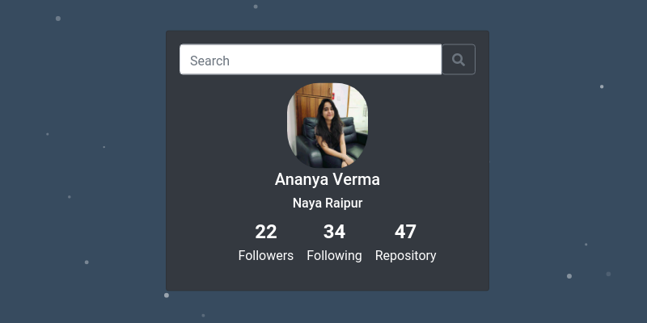

_A simple Github Card to search user by username. THe result shows the details of he user: Name, Location, Followers, Following and Repository_.

**Github Card** - <a href="https://verma-ananya.github.io/github-card/" target="_blank">Project Link</a>

Github Card is a mini project in which following technologies, languages and libraries are used.  

<li> HTML 
<li> CSS
<li> React
<li> React-Particles 
<li> Github API 

   

