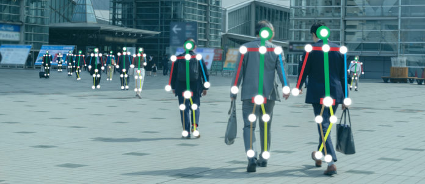

_**Objective** : A model is developed to detect the major key points of the body in the image/video using the image/video as the input stream and track the movements of the key–points using OpenCV to reduce the overheads of installation of Motion Sensing Technology which uses Infrared Sensors._.

_**Project Link**_ - <a href="https://github.com/verma-ananya/HumanBody-Skeleton-Detection-using-OpenCV" target="_blank">Human-Body Skeleton Detection using OpenCV</a>

**Motivation - Why do we need to detect the key-points of the human body?**   

<li> Motion sensing technology is increasingly deployed in many applications where human detection is reqired such as gaming, security and military.

<li> Motion sensing input device such as Microsoft's Xbox 360 Kinect provides this applicability using infrared sensors, IR sensors are much more expensive comapred to optical cameras.

<li> Installation procedure is hectic and inconvenient to be widely used.

 
 

**Datasets used for training the model** - COCO dataset and MPII dataset.

 
 

**Applications** - This model can be integrated into the systems for various purposes. Few of them are listed below:

<li> <b>Game Strategy</b> - It can be used to understand the gameplay of a player and his next moves to improve the game strategy.

<li> <b>Orthopaedic patient diagnosis</b> - It can be used by the doctors to understand the key points while analysing the body postures of the patients.

<li> <b>Injury Analysis of Sportsperson</b> - It can be used by the sports authorities to live track the player's movements and detect the key-points of the body to understand the injury reasons if occured any.

<li><b>Gymnasium</b> - It can be used by the gymnastic person to improve their movement's in order to prevent future injuries.

<li><b>Surveillance Activities</b> - Action and behaviour analysis by gestures, body movements, and detection of abnormal activities. 

  
This project was selected for <b>Industrial Academic Meet (IAM) 2019</b> held at IIIT Raipur under the track - Data Science and Machine Learning.