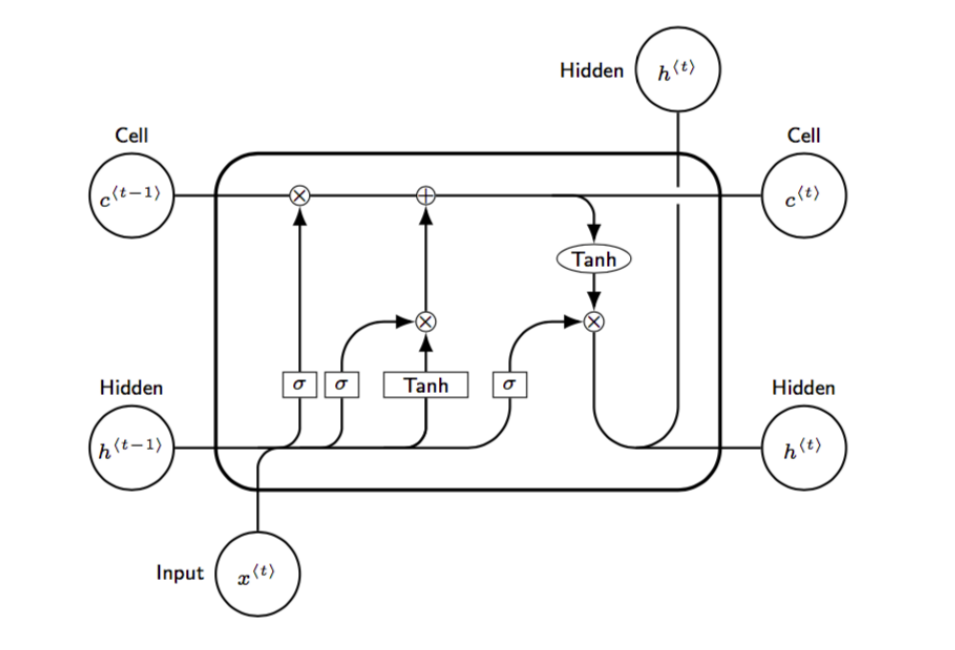

_**Objective** : To classify Human Behaviour into two categories mainly, "Laughter" and "Filler" using Social Signal Processing, Machine Learning, and Deep Learning Models._.

_**Project Link**_ - <a href="https://github.com/verma-ananya/Classification-of-Social-Signals-using-LSTM" target="_blank">Classification of Social Signals using LSTM</a>

**What are Social Signals?** Social Signals, also known as Communicative or Informative Signals are observable behaviours that people display during their social interactions. 

**What is Social Intelligence?** "Social intelligence is the ability to recognize human social signals and social behaviours like turn taking, politeness, and disagreement – in order to become more effective and more efficient providing accurate computerised analysis of behaviour."

**Why is it important to understand the non-verbal social cues?** While having conversations, our attention focuses on words, but we are immersed in a rich nonverbal world influencing not only the meaning of the words, but also our perception of the social context. Individual's decision-making is strongly affected by non-verbal behaviour. The gestures, posture, facial expressions can now be well detected using Artificial Intteligence. Also, many important characteristics may reveal during interactions such as thought process. In order to understand the overall context of the conversation, one must need to analyse and process the situational tenses being involved. 

<!-- 
Fig 1.
  -->

**Inspiration of using LSTM Model** - For considering the past references to under the context of the conversation, **memory** is needed. In order to do so, Recurrent Neural Network (RNN) can be used where the output from the previous step are fed as input to the current step. But there are few drawbacks of using RNN model.   

<li> RNNs are not able to keep track of long-term dependencies.
<li> It is very unstable.
<li> RNNs cannot be stacked into very deep models.

**Long Short Term Memory Model (LSTM)**

A LSTM layer comprises of recurrently connected memory blocks. Each memory block consists of one or more recurrently connected memory cell units, three multiplicative units and three gates mainly the input, forget and output gates which regulates the flow of information inside the meory block. Each cell memorizes the previous state’s values over time intervals such that information inside and outside the cell is regulated via these three gates.

This project is selected for presentation in **SPCOM 2020 conference(International Conference on Signal Processing and Communication)**. <a href="https://ece.iisc.ac.in/~spcom/2020/CameraReadySubmissions/263/CameraReadySubmission/Classification_of_social_signals_263_Joshi_Verma_Mishra.pdf" target="_blank">Link</a>